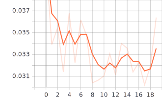
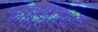

# car_end2end

## Nvidia Model

稳如狗......

|  Model  |  Loss  |  Val Loss  |  Map  |
|  -----  |  :----:  |  :----:  |  :----:  |
| train-noraml  |   |   |   |
| train-dropout |  |  |  |

## Fine Tune

存在过拟合现象......

|  Model  |  Loss  |  Val Loss  |  Map  |
|  -----  |  :----:  |  :----:  |  :----:  |
| train-vgg16 |  |  |  |
| train-vgg19 |  |  |  |

## 失败场景
|  Type  |  Image  |
|  -----  |  :----:  |
| 切着跑道 |  |
| 压到跑道 |  |
| 卡在跑道 |  |
| 冲出跑道 |  |
| 路线错误 |  |

