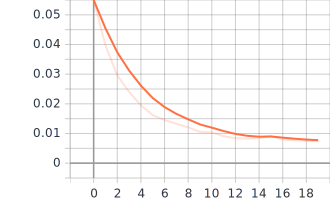
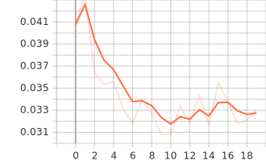
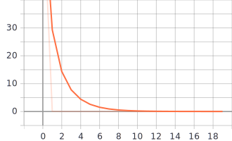
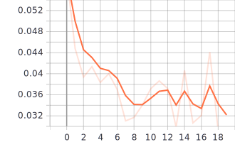
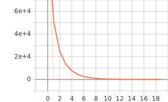
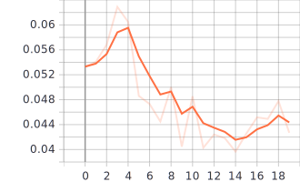
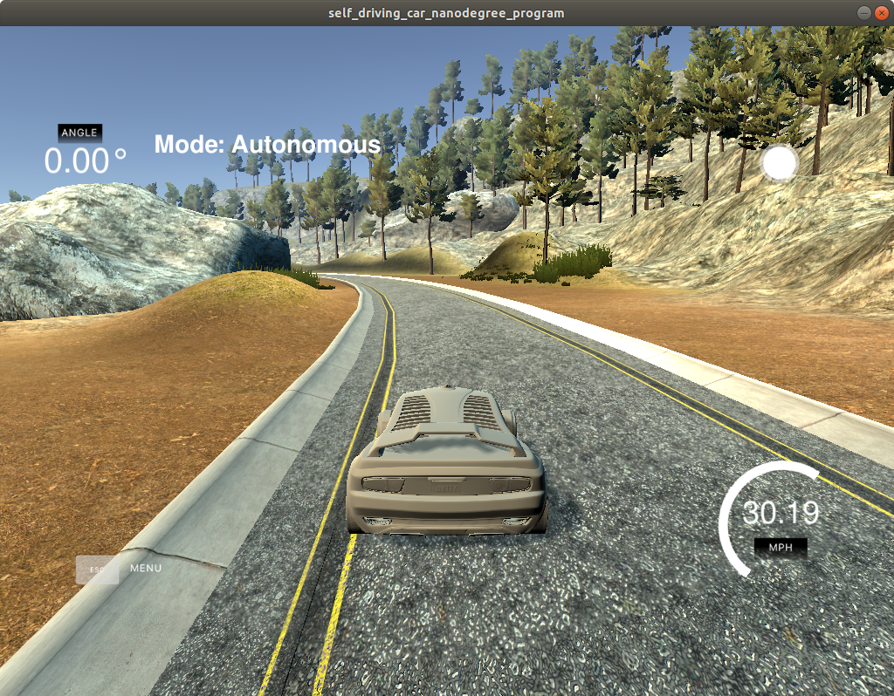
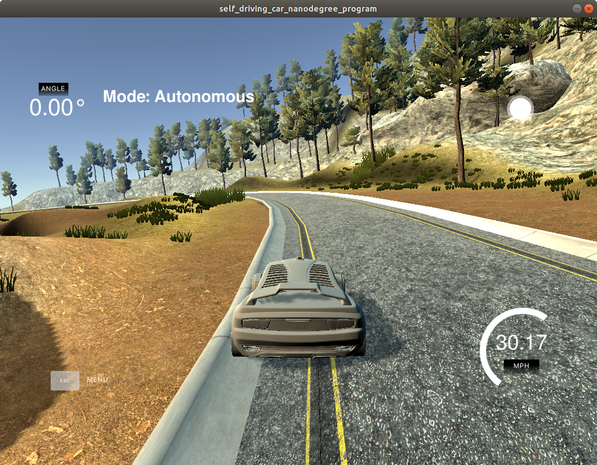
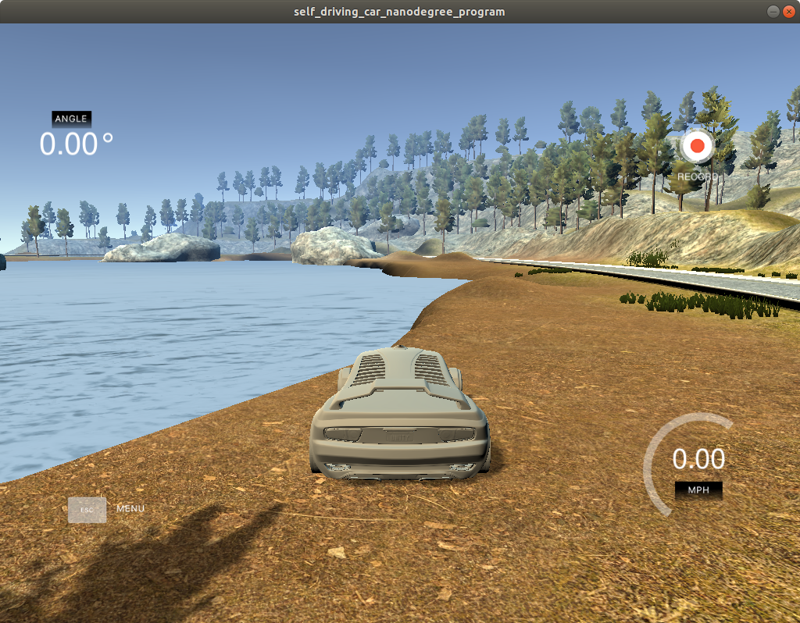
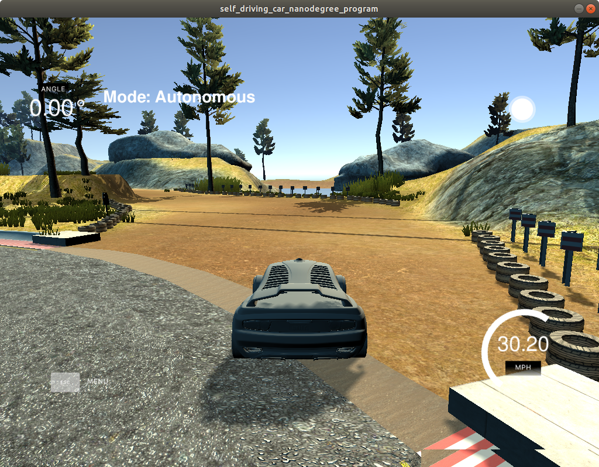

# car_end2end

## Nvidia Model

效果好

|  Model  |  Loss  |  Val Loss  |  Map  |
|  -----  |  :----:  |  :----:  |  :----:  |
| train         |  |  |  |
| train-dropout |  |  |  |

## Fine Tune

过拟合

|  Model  |  Loss  |  Val Loss  |  Map  |
|  -----  |  :----:  |  :----:  |  :----:  |
| train-vgg16 |  |  |  |
| train-vgg19 |  |  |  |

## 错误场景
|  Type  |  Image  |
|  -----  |  :----:  |
| 1.切着跑道 |  |
| 2.压到跑道 |  |
| 3.卡在跑道 |  |
| 4.冲出跑道 |  |
| 5.路线错误 |  |

